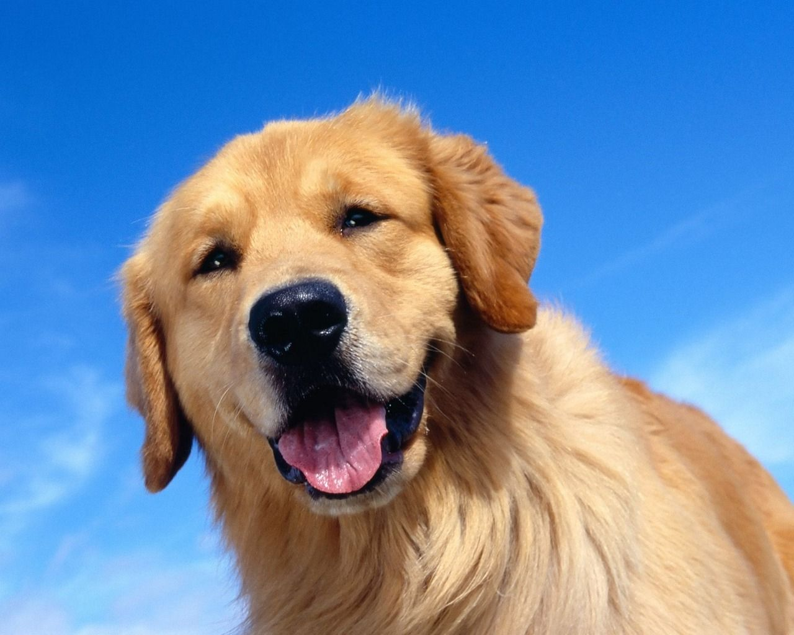
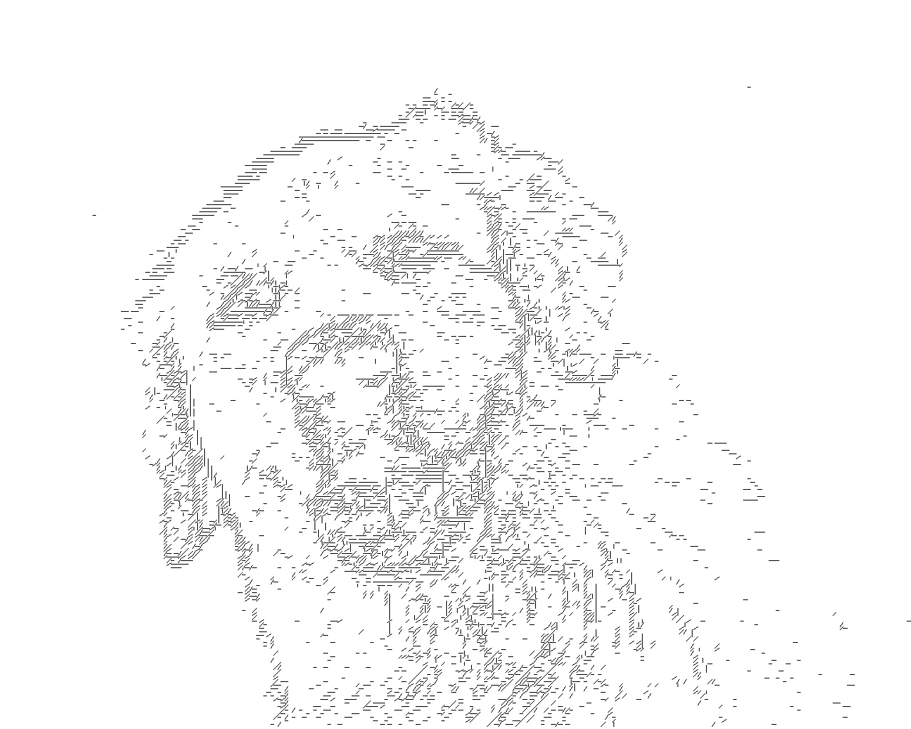
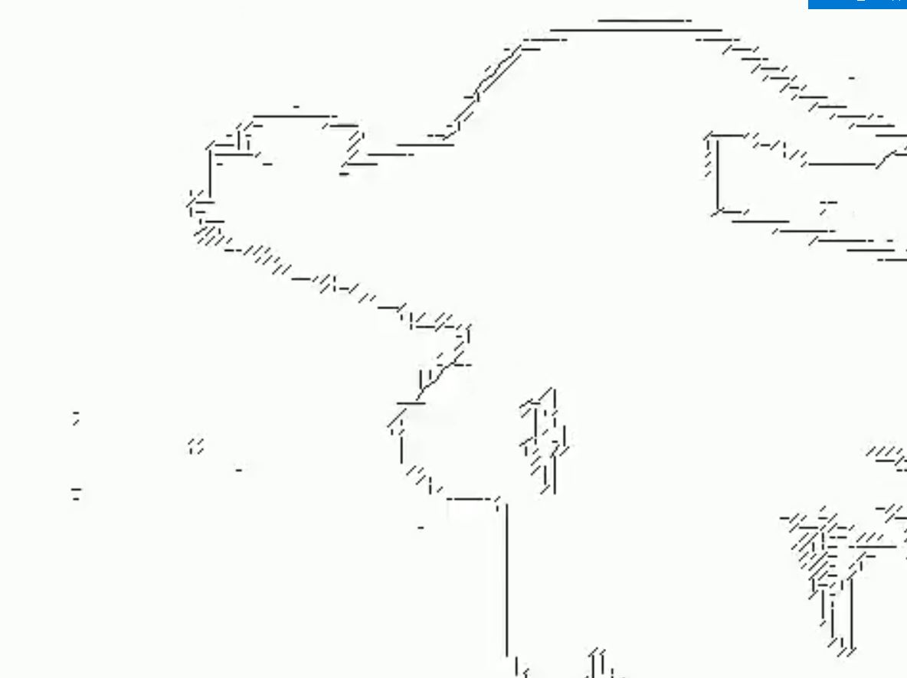

# ImageToLines
Небольшое пирложение, которое использует предобученную модель для распознавания линий на картинке для обработки картинок и видео

## Основная функциональность
- Обработать изображение с помощью предварительно подготовленной модели: `process_inage.py`
- Обработать видео с помощью предварительно подготовленной модели: `process_video.py`
- Наложить оригинальное аудио на видео: `merge_video_audio.py`

## Примеры
### Обработка изображений
- Оригинал

- Обработка

### Обработка видео
- Оригинал: https://www.youtube.com/watch?v=FtutLA63Cp8
- Обработка: https://www.youtube.com/watch?v=_EnroIeXQ74

## Ссылки
Для создания и тренировки модели используется **NeuralHelper**
https://github.com/kostyanoy/NeuralHelper
